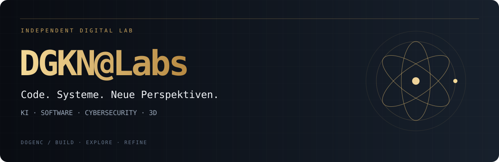
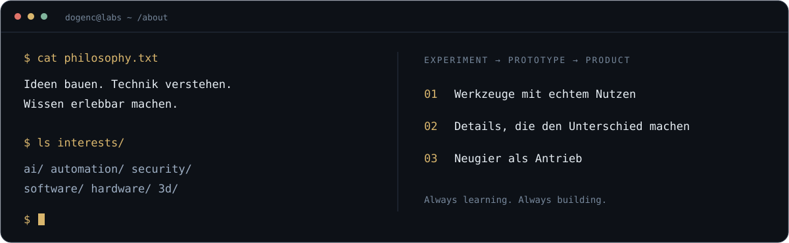

 

**KI & Automatisierung · Software & Systeme · Cybersecurity · Interaktive 3D-Welten**

Ich entwickle unter **DGKN@Labs** eigene Werkzeuge, digitale Experimente und interaktive Lernwelten.  
Mich interessiert, wie Technik funktioniert — und was sich daraus bauen lässt.

[Projekte entdecken](https://github.com/dogenc?tab=repositories) &nbsp; · &nbsp; [Instagram](https://www.instagram.com/dgkn_labs/)

 

 

## Aus dem Lab

<table>
<tr>
<td width="50%" valign="top">

### 🧬 CELLULA
**Das Unsichtbare entdecken.**

Interaktive Zellbiologie und räumliche Lernwelten: biologische Strukturen erkunden und Zusammenhänge verstehen.

[Repository öffnen →](https://github.com/dogenc/CELLULA)

</td>
<td width="50%" valign="top">

### 🌍 TERRA
**Die Welt aus neuen Perspektiven.**

Ein digitales Lernprojekt rund um unsere Erde — mit räumlicher Darstellung und interaktiver Erkundung.

[Repository öffnen →](https://github.com/dogenc/TERRA)

</td>
</tr>
</table>

[**Alle öffentlichen Projekte ansehen →**](https://github.com/dogenc?tab=repositories)

## Mein Werkzeugkasten

Technologien, mit denen ich arbeite und experimentiere:

## Woran ich gern arbeite

- **KI & Automatisierung:** Assistenten, lokale Modelle und praktische Workflows.
- **Software & Sicherheit:** nachvollziehbare Prozesse, Analysewerkzeuge und durchdachte Oberflächen.
- **Wissen & 3D:** komplexe Themen anschaulich und interaktiv vermitteln.
- **Hardware & Systeme:** Mikrocontroller, Linux und eigene Experimente.

---

<pre>
 ██████╗  ██████╗ ██╗  ██╗███╗   ██╗
 ██╔══██╗██╔════╝ ██║ ██╔╝████╗  ██║
 ██║  ██║██║  ███╗█████╔╝ ██╔██╗ ██║
 ██║  ██║██║   ██║██╔═██╗ ██║╚██╗██║
 ██████╔╝╚██████╔╝██║  ██╗██║ ╚████║
 ╚═════╝  ╚═════╝ ╚═╝  ╚═╝╚═╝  ╚═══╝
                 @Labs
</pre>

**Von der Idee zum eigenen System.**

